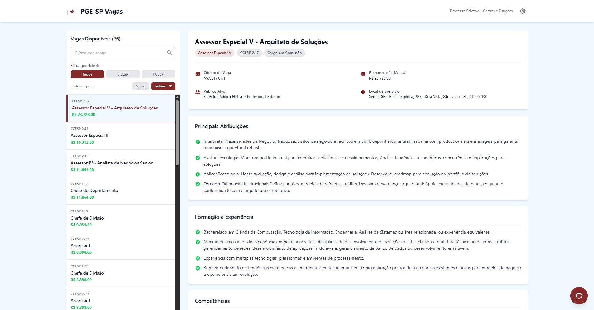

# Painel Processo Seletivo PGE-SP

An interactive and AI-powered job board designed to explore positions and functions available in a public selection process for the Procuradoria Geral do Estado de São Paulo (PGE-SP). This application provides a modern, user-friendly interface for potential candidates to search, filter, and understand the available roles in detail.



---

## ✨ Key Features

- **Dynamic Job List**: Browse all available positions with key information at a glance.
- **Advanced Search & Filtering**: Quickly find relevant jobs by searching for keywords or filtering by level (`CCESP` or `FCESP`).
- **Flexible Sorting**: Sort positions by title or remuneration (`asc`/`desc`).
- **Detailed Job View**: Select a job to see a comprehensive breakdown of its responsibilities, requirements, competencies, and salary.
- **AI-Powered Chatbot**: Ask questions in natural language about the job roles. The chatbot uses Google Gemini to understand the query and provide answers based on the context of the available positions.
- **Integrated Document Viewer**: Access and view official documents, such as the "Processo Seletivo" notice and the salary table ("Anexo I"), directly within the application.
- **Responsive Design**: A fully responsive layout that works seamlessly on desktop, tablet, and mobile devices.
- **Light & Dark Mode**: Switch between themes for comfortable viewing in any lighting condition.

## 🚀 Tech Stack

- **Frontend**: React, TypeScript
- **Styling**: Tailwind CSS
- **Generative AI**: Google Gemini API (`@google/genai`)

## 📂 Project Structure

The project follows a modular and scalable architecture, designed for maintainability and future expansion.

```
/src
|-- /components
|   |-- /Chatbot        # Chatbot specific components
|   |-- /Job            # Job list and details components
|   |-- /common         # Shared components (Header, Logo, etc.)
|   `-- /documents      # PDF viewer/mockup components
|-- /data
|   `-- jobs.ts         # Static job data
|-- /services
|   |-- /providers
|   |   `-- gemini.ts   # Gemini API implementation
|   `-- aiService.ts    # AI service abstraction layer
|-- /types
|   `-- index.ts        # TypeScript type definitions
|-- /utils
|   |-- currency.ts     # Currency formatting helpers
|   `-- jobSearch.ts    # Job searching and scoring logic
|-- App.tsx             # Main application component
`-- index.tsx           # Application entry point
```

### Key Architectural Concepts

- **Separation of Concerns**: Logic is separated from the UI. For instance, AI communication logic is in `/services`, while the chat UI is in `/components/Chatbot`.
- **Modularity**: Components are grouped by feature, making them easy to find and manage.
- **AI Service Abstraction**: The `aiService.ts` file provides a generic interface for interacting with any AI model. This makes it simple to swap `Gemini` with another provider like `OpenAI` in the future without refactoring the components that use it.

## ⚙️ Getting Started

### Prerequisites

- An active API key for the Google Gemini API.

### Local Development

1.  **Clone the repository:**
    ```bash
    git clone https://github.com/patrickcruzutfpr/processo-seletivo-pge
    cd processo-seletivo-pge
    ```

2.  **Set up environment variables:**
    The application requires a Google Gemini API key to be available as an environment variable named `API_KEY`. The application is configured to access this key via `process.env.API_KEY`.

3.  **Run the application:**
    This project is ready to run in a compatible web development environment. Once the environment is set up and the API key is configured, the application can be served locally.

## 🤖 AI Service Abstraction

To ensure the application is not tightly coupled to a single AI provider, we use a service abstraction layer.

**`src/services/aiService.ts`** defines a generic `AiChatProvider` interface:

```typescript
export interface AiChatProvider {
  chat(query: string, contextJobs: Job[]): Promise<string>;
}
```

This allows us to create different provider implementations. The current Gemini implementation is in `src/services/providers/gemini.ts`.

To add a new provider (e.g., OpenAI), you would simply:
1.  Create a new file `src/services/providers/openai.ts`.
2.  Implement the `chat` method using the OpenAI API.
3.  Register the new provider in `aiService.ts`.

This design makes the application flexible and future-proof.
